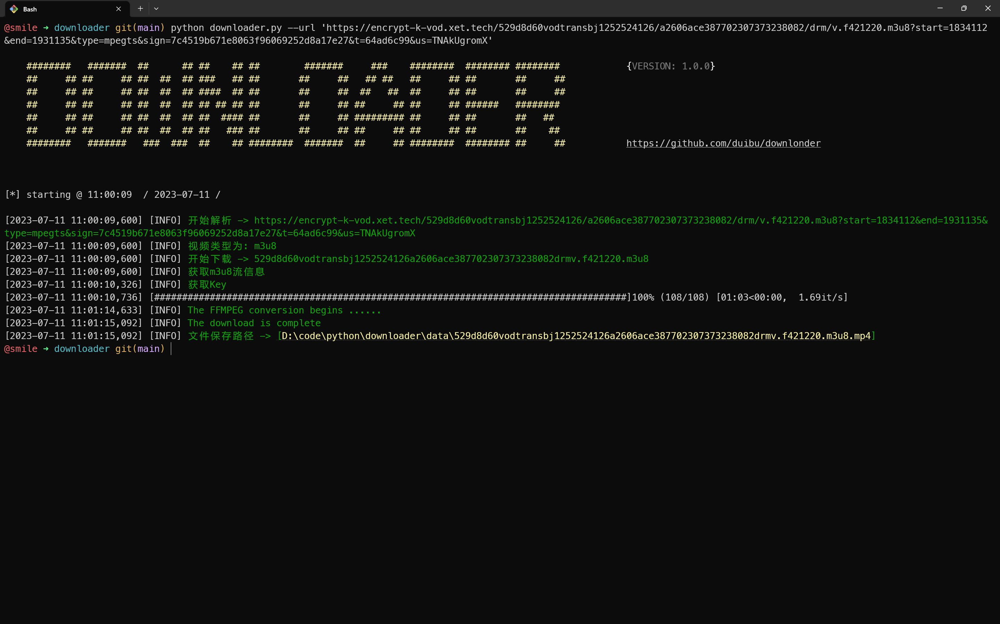
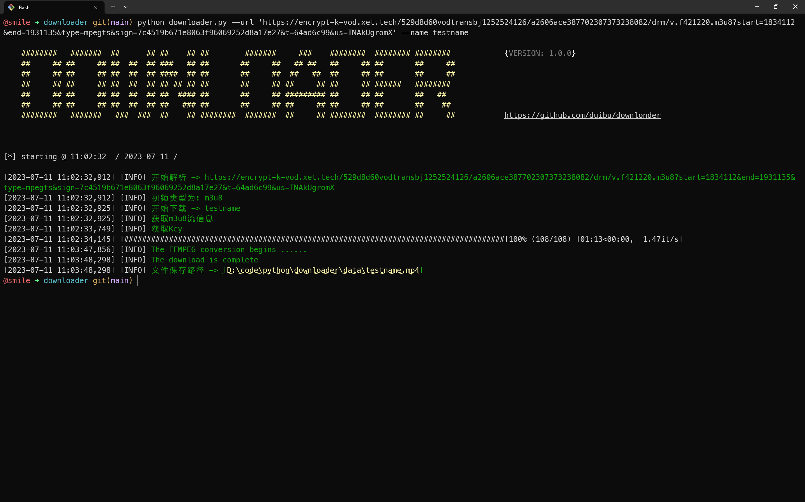
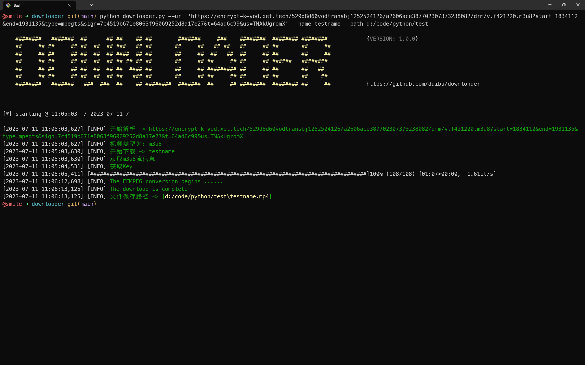
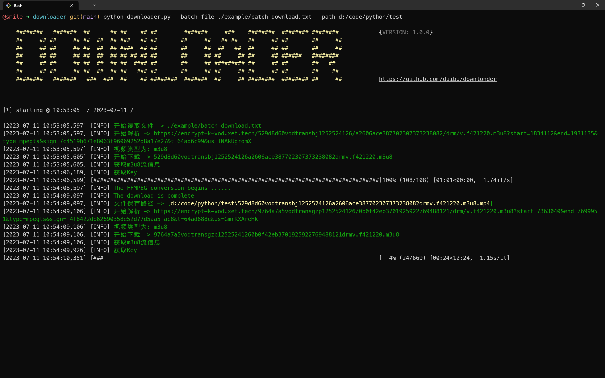
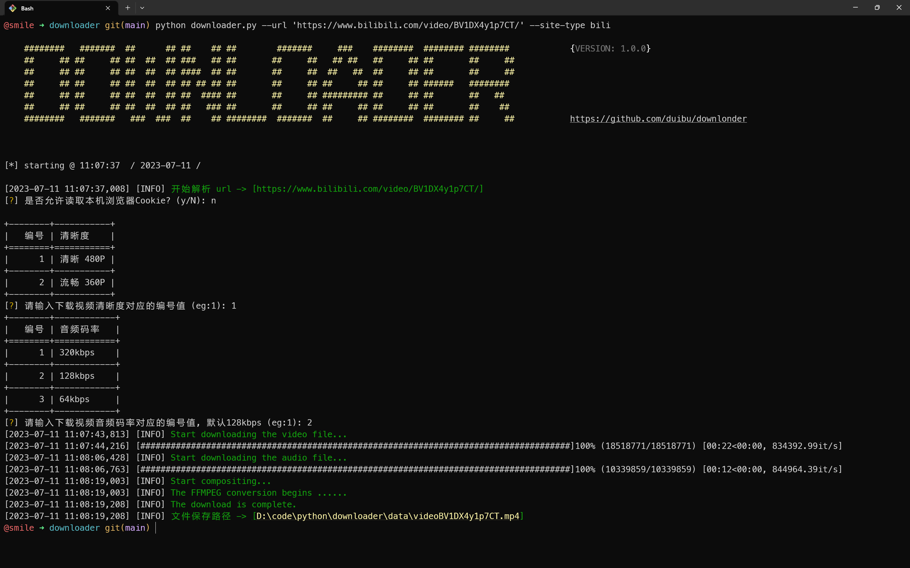
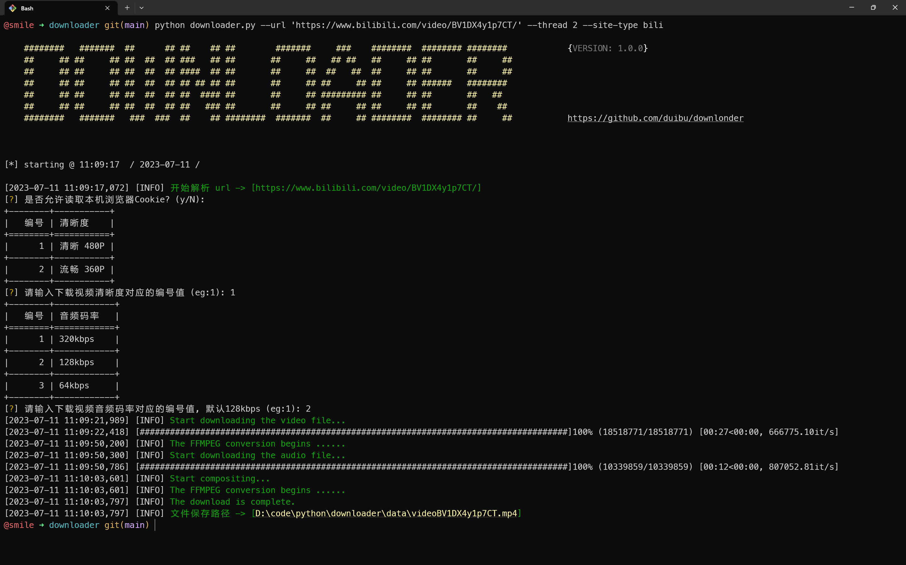

# 🌱 Downloader
[](https://www.python.org/) [](https://raw.githubusercontent.com/duibu/downloader/main/LICENSE) 

```
             @@                       
             @@                       
             @@     
             @@         
         #   @@   #     
           + @@ *                     
            @@@@        
                              
     @                @               
     @@**************@@  
```

本项目主要用于下载各种网站的视频，目前支持m3u8流媒体文件下载和b站视频下载(单个视频，番剧等还在努力开发中)，并且支持多线程下载，其他类型（或网站）视频的下载还在努力开发中......

## 🏆 环境说明

python:3.x

## 🔧 安装

使用git下载代码

```
git clone https://github.com/duibu/downloader.git
```

安装所需依赖

```
pip install -r requirements.txt
```

## 🚀 参数说明

```
-u --url: 下载视频的url地址，只可以设置单个url
--name --video-name: 下载到本地视频的文件名称
--path --save-path: 视频保存路径
--batch-file: 批量地址文件的绝对路径，批量下载时使用，支持csv和txt
--thread: 下载视频文件的线程数
--site-type: 网站类型，例如下载b站视频时该项配置bili
--proxy: 配置代理信息，示例(clash for windows)：--proxy http=http://127.0.0.1:7890 https=http://127.0.0.1:7890
```

## 🔨 使用示例

### 下载单个视频

直接下载

```bash
python downloader.py --url 'http://example.com/example.m3u8?xxx=xxx'
```



指定文件名称下载

```bash
python downloader.py --url 'http://example.com/example.m3u8?xxx=xxx' --name video
```



指定保存路径和文件名下载

```bash
python downloader.py --url 'http://example.com/example.m3u8?xxx=xxx' --name video --path /home/user/video
```



下载时配置代理

```bash
python downloader.py --url 'http://example.com/example.m3u8?xxx=xxx' --proxy http='http://127.0.0.1:7890' https='https://127.0.0.1:7890'
```

### 批量下载

批量下载url文件示例

- [CSV文件](./example/batch-download.csv)
- [TXT文件](./example/batch-download.txt)

```bash
python downloader.py --batch-file d:/video/url.txt --path /home/user/video
```



## b站视频下载

直接下载

```bash
python downloader.py --url 'https://www.bilibili.com/video/BV1DX4y1p7CT/' --site-type bili
```



多线程下载

```bash
python downloader.py --url 'https://www.bilibili.com/video/BV1DX4y1p7CT/' --thread 2 --site-type bili
```




## ❓ Q&A

1. 使用Clash for Windows科学上网之后提示网络异常

   由于Clash for Windows配置代理时，只有http协议可以正常使用代理，https协议需要使用 `http://localhost:7890` 才可以代理，所以建议关掉代理或者手动输入代理协议以及地址，详情请使用--help命令查看参数说明

2. 提示权限不足

   有些资源需要授权才可以访问，比如bilibili 1080P的视频，使用时请允许程序读取浏览器cookie；如果允许读取cookie依旧没有权限，请检查所选cookie对应的浏览器对应网站账户的登录状态

3. 无法读取cookie

   Windows操作系统会存在cookie文件被浏览器占用的情况，如果程序无法读取cookie，建议关掉浏览器后重新运行程序

4. 其他问题

   如果遇到其他问题，请提交 Issues，同时也欢迎您修复后合并。也欢迎多多提意见

## ©️ License

Copyright (c) Microsoft Corporation. All rights reserved.

Licensed under the [MIT](LICENSE) license.